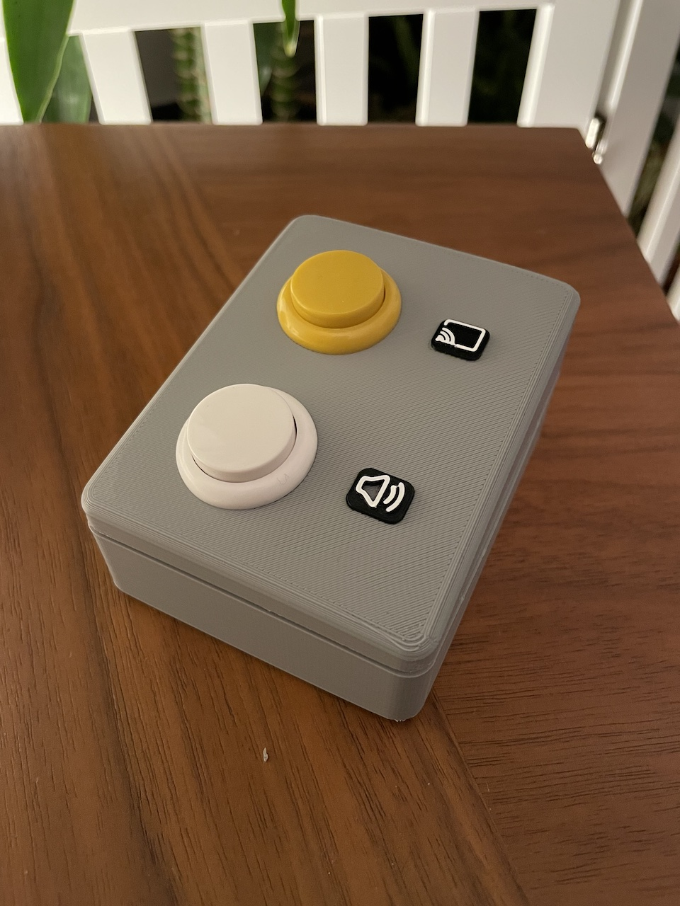

ZoomBox
=======

A simple, 3D printed, 2-button control keyboard for Zoom calls. By default mutes/unmutes with one button and starts/stops screen share with the other one.

Case is designed for Arduino UNO and bulky 24mm arcade style buttons. Optionally, M2 screws can be used to secure the Arduino board to the case.

Dependencies
------------

- [Hoodloader2](https://github.com/NicoHood/HoodLoader2)
- [AceButton](https://github.com/bxparks/AceButton)
- [HID](https://github.com/NicoHood/HID)

Setup
-----

Follow instructions on [Hoodloader2's wiki](https://github.com/NicoHood/HoodLoader2/wiki) to get your Arduino UNO's 16u2 unit ready for sketch upload. Then compile and upload the ZoomBox sketch on it. Connect GND to one side of the buttons. Connect remaining pins to D2 and D3 (PCINT2 and PCINT3) on the 16u2. More information is available on [this excellent documentation at Hoodloader2](https://github.com/NicoHood/HoodLoader2/wiki/Arduino-Uno-Mega-16u2-Pinout).
